# Doosii - Database Schema & ERD

## 1. Overview & Strategy
- **Engine**: Microsoft SQL Server 2022
- **Database**: `DoosiiDb`
- **Design Pattern**: Single Database with **Schema Separation** to maintain modularity and ACID transactional integrity.
- **Schemas**: `auth`, `store`, `order`, `forum`, `notification`.

---

## 2. Entity-Relationship Diagram (Mermaid)

```mermaid
erDiagram
    %% AUTH SCHEMA
    auth_Users ||--o{ auth_MerchantProfiles : "has"
    auth_Users ||--o{ auth_RefreshTokens : "owns"
    auth_Users ||--o{ store_Stores : "owns"
    auth_Users ||--o{ order_Orders : "buys/sells"
    auth_Users ||--o{ forum_PassPosts : "creates"
    auth_Users ||--o{ forum_Comments : "writes"
    auth_Users ||--o{ notification_Notifications : "receives"

    auth_Users {
        int Id PK
        string Email UK
        string FullName
        string PasswordHash
        string Role "Customer | Seller | Admin"
        bool IsGoogle
        datetime CreatedAt
        datetime UpdatedAt
    }

    auth_MerchantProfiles {
        int Id PK
        int UserId FK
        string StoreName
        string Phone
        string Address
        decimal Latitude
        decimal Longitude
        string KycStatus "PENDING | APPROVED | REJECTED"
        string LicenseImageUrl
        string FrontFacadeUrl
        string IdCardFrontUrl
        string IdCardBackUrl
        string RejectionReason
        datetime CreatedAt
    }

    auth_RefreshTokens {
        int Id PK
        int UserId FK
        string Token UK
        datetime ExpiresAt
        bool IsRevoked
        datetime CreatedAt
    }

    auth_EmailOtps {
        int Id PK
        string Email
        string OtpCode
        string Purpose "ForgotPassword | RegisterVerification"
        datetime ExpiresAt
        bool IsUsed
        datetime CreatedAt
    }

    %% STORE SCHEMA
    store_Stores ||--o{ store_Products : "stocks"
    store_Stores ||--o{ store_StoreReviews : "receives"

    store_Stores {
        int Id PK
        int OwnerId FK
        string Name
        string Description
        string Phone
        string Address
        decimal Latitude
        decimal Longitude
        string OpeningHours
        bool IsActive
        decimal RatingAverage
        int RatingCount
        datetime CreatedAt
    }

    store_Categories ||--o{ store_Products : "categorizes"
    store_Categories {
        int Id PK
        string Name
        string Slug UK
    }

    store_Products ||--o{ store_ProductImages : "contains"
    store_Products {
        int Id PK
        int StoreId FK
        int CategoryId FK
        string Title
        string Description
        decimal Price
        string Size
        int ConditionPercent
        string Status "AVAILABLE | LOCKED | SOLD"
        string StyleTags
        datetime CreatedAt
    }

    store_ProductImages {
        int Id PK
        int ProductId FK
        string ImageUrl
        int DisplayOrder
    }

    store_StoreReviews {
        int Id PK
        int StoreId FK
        int UserId FK
        int Rating
        string Comment
        string ImagesJson
        datetime CreatedAt
    }

    %% ORDER SCHEMA
    order_Orders ||--o{ order_OrderItems : "contains"
    order_Orders ||--o{ order_EscrowTransactions : "records"
    order_Orders ||--o{ order_PaymentLogs : "logs"
    order_Orders ||--o| order_Disputes : "may have"

    order_Orders {
        int Id PK
        int BuyerId FK
        int SellerId FK
        decimal ProductPrice
        decimal ShippingFee
        decimal EscrowFee
        decimal TotalAmount
        string Status "PENDING_PAYMENT | ESCROW_HOLDING | IN_TRANSIT | COMPLETED_RELEASED | DISPUTED | REFUNDED | CANCELLED"
        string ShippingCarrier
        string TrackingCode
        string ShippingAddress
        string ReceiverName
        string ReceiverPhone
        datetime PaidAt
        datetime ShippedAt
        datetime CompletedAt
        datetime CreatedAt
    }

    order_OrderItems {
        int Id PK
        int OrderId FK
        int ProductId
        string ProductNameSnapshot
        decimal PriceSnapshot
        string ThumbnailSnapshot
    }

    order_EscrowTransactions {
        int Id PK
        int OrderId FK
        decimal Amount
        string Status "HOLDING | RELEASED | REFUNDED"
        datetime ReleasedAt
    }

    order_PaymentLogs {
        int Id PK
        int OrderId FK
        string Gateway "PayOS | SePay"
        string TransactionCode
        decimal Amount
        string RawPayload
        datetime CreatedAt
    }

    order_Disputes {
        int Id PK
        int OrderId FK
        int RaisedByUserId FK
        string Reason
        string EvidenceVideoUrl
        string EvidenceImagesJson
        string Status "PENDING_REVIEW | REFUNDED_BUYER | RELEASED_SELLER"
        string AdminVerdict
        datetime CreatedAt
    }

    order_WithdrawalRequests {
        int Id PK
        int UserId FK
        string BankName
        string AccountNumber
        string AccountHolder
        decimal Amount
        string Status "PENDING | APPROVED | REJECTED"
        datetime CreatedAt
    }

    %% FORUM SCHEMA
    forum_PassPosts ||--o{ forum_PostImages : "has"
    forum_PassPosts ||--o{ forum_Comments : "receives"
    forum_PassPosts ||--o{ forum_Reactions : "receives"

    forum_PassPosts {
        int Id PK
        int AuthorId FK
        string Title
        string Description
        decimal Price
        string Size
        int ConditionPercent
        bool AllowEscrow
        string Status "ACTIVE | LOCKED | SOLD | HIDDEN"
        string StyleTags
        datetime CreatedAt
    }

    forum_PostImages {
        int Id PK
        int PostId FK
        string ImageUrl
        int DisplayOrder
    }

    forum_SpotSharingPosts {
        int Id PK
        int AuthorId FK
        int TaggedStoreId FK
        decimal Latitude
        decimal Longitude
        string LocationName
        string Content
        string ImagesJson
        datetime CreatedAt
    }

    forum_Comments {
        int Id PK
        int PostId FK
        int ParentCommentId FK
        int AuthorId FK
        string Content
        datetime CreatedAt
    }

    forum_Reactions {
        int Id PK
        int PostId FK
        int UserId FK
        string ReactionType "LIKE | HEART"
        datetime CreatedAt
    }

    %% NOTIFICATION SCHEMA
    notification_Notifications {
        int Id PK
        int UserId FK
        string Title
        string Message
        string Type
        string TargetUrl
        bool IsRead
        datetime CreatedAt
    }
```

---

## 3. Key Enums & Constraints
- **`Role`**: `Customer` (default), `Seller`, `Admin`.
- **`KycStatus`**: `PENDING`, `APPROVED`, `REJECTED`.
- **`ProductStatus`**:
  - `AVAILABLE`: Publicly visible and purchasable.
  - `LOCKED`: Reserved for an order in `PENDING_PAYMENT` (15 min timer) or active escrow.
  - `SOLD`: Item completed and permanently sold.
- **`OrderStatus`**:
  - `PENDING_PAYMENT` $\rightarrow$ `ESCROW_HOLDING` $\rightarrow$ `IN_TRANSIT` $\rightarrow$ `COMPLETED_RELEASED`
  - Fallbacks: `CANCELLED` (unpaid after 15m), `DISPUTED` (buyer files complaint), `REFUNDED` (buyer return approved).
- **Unique Indexes**:
  - `IX_Users_Email` (`auth.Users.Email`)
  - `IX_RefreshTokens_Token` (`auth.RefreshTokens.Token`)
  - `IX_EmailOtps_Email_OtpCode_Purpose` (`auth.EmailOtps.[Email, OtpCode, Purpose]`)
  - `IX_Categories_Slug` (`store.Categories.Slug`)
